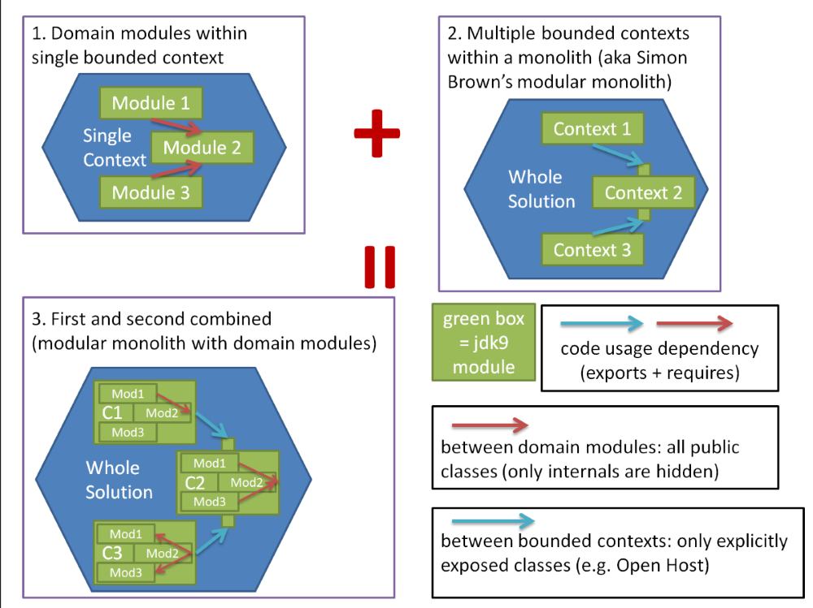

# ddd-jdk9-modules
Domain Driven Design meets Java 9 modularization.



## DDD Java 9 Module Links

- https://stackoverflow.com/questions/39771709/java-9-module-and-double-dispatch-in-ddd

## JDK 9 Links

- http://cr.openjdk.java.net/~mr/jigsaw/ea/module-summary.html
- https://blog.codefx.org/java/java-9-migration-guide/

## Running Netbeans 8.2 with JDK 9

```
-J--add-opens=java.base/java.net=ALL-UNNAMED -J--add-opens=java.base/java.lang=ALL-UNNAMED -J--add-opens=java.base/java.nio=ALL-UNNAMED -J--add-opens=java.desktop/sun.awt=ALL-UNNAMED -J--add-opens=java.desktop/javax.swing=ALL-UNNAMED -J--add-opens=java.desktop/javax.swing.text=ALL-UNNAMED -J--add-modules=java.activation
```

Unfortunately no JDK 9 can be used because of the changed folder structure.
